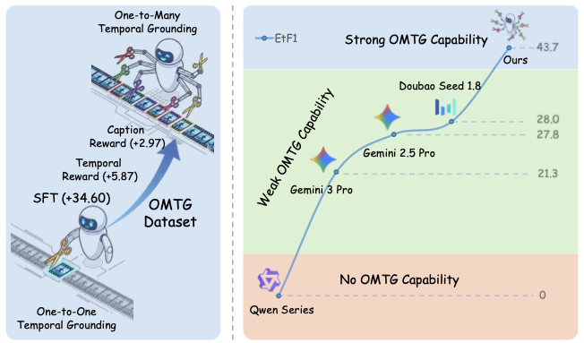

# OMTG

Official training code for **Towards One-to-Many Temporal Grounding**.

by
Qi Xu,
Yue Tan,
Shihao Chen,
Jiahao Meng,
Anna Wang,
Shunping Ji,
Hao Fei
and
Jason Li

[[📖 Paper](https://arxiv.org/abs/2606.06294)] | [[🌟 Project Page](https://insomniaaac.github.io/OMTG/)] | [[🤗 Dataset](https://huggingface.co/datasets/insomnia7/omtg56k)] | [[🤗 Benchmark](https://huggingface.co/datasets/insomnia7/omtg_bench)]

**TL; DR**: OMTG studies one-to-many temporal grounding, where a single query may correspond to multiple disjoint video moments. This repository releases the training pipeline for our 56k-sample dataset, benchmark, supervised fine-tuning, and reinforcement learning recipe tailored to precise and complete multi-moment localization.



**Abstract**: Temporal Grounding (TG) aims to localize video segments corresponding to a textual query. Prior research predominantly focuses on single-segment retrieval. Real-world scenarios, however, often require localizing multiple disjoint segments for a single query—a setting we term **One-to-Many Temporal Grounding (OMTG)**. Previous state-of-the-art MLLMs, optimized for one-to-one settings, struggle in this context, often yielding near-zero scores due to a lack of event cardinality perception. To bridge this gap, we present a systematic solution with three key contributions. First, we establish the first comprehensive OMTG benchmark, introducing Count Accuracy (C-Acc) and Effective Temporal F1 (EtF1) as evaluation metrics. Second, we curate a high-quality OMTG dataset comprising 56k samples through a sophisticated construction pipeline. Third, we develop novel temporal and caption reward functions specifically designed for OMTG. In particular, the caption reward leverages Chain-of-Thought reasoning over dense video captions to explicitly guide policy optimization toward both preciseness and completeness. Extensive experiments show our model achieves a new state-of-the-art EtF1 of 43.65% on OMTG Bench, outperforming Gemini 2.5 Pro and Seed-1.8 by 15.85% and 15.61%, respectively.

# Updates

- 2026.05.01, **Towards One-to-Many Temporal Grounding** is accepted by **ICML 2026**!!!
- 2026.05.01, we release the project page, paper, OMTG-56k dataset, OMTG Bench benchmark, and training code.

# Quick Start

## Installation

### SFT

```bash
bash sft/install_qwen3vl.sh
```

### RL

```bash
bash rl/scripts/install_rl.sh
```

## Data Preparation

We release the following resources for one-to-many temporal grounding:

- **OMTG-56k dataset**: [https://huggingface.co/datasets/insomnia7/omtg56k](https://huggingface.co/datasets/insomnia7/omtg56k)
- **OMTG Bench benchmark**: [https://huggingface.co/datasets/insomnia7/omtg_bench](https://huggingface.co/datasets/insomnia7/omtg_bench)

### SFT

Place the SFT data under `data/`. The default config uses the JSONL files listed in `sft/qwen3vl_4b_omtg_wcot.yaml`.

### RL

Prepare one training parquet file and one evaluation parquet file, then pass them through environment variables when launching training.

## Training

### SFT

```bash
bash sft/train_qwen3vl.sh sft/qwen3vl_4b_omtg_wcot.yaml
```

### RL

Activate the RL environment first:

```bash
source rl/.venv/bin/activate
```

Set the SFT checkpoint and parquet files first:

```bash
MODEL_PATH=/path/to/sft_checkpoint \
TRAIN_PARQUET=/path/to/train.parquet \
EVAL_PARQUET=/path/to/eval.parquet \
bash rl/scripts/grpo_4b_coldstart_caption_agent.sh
```

To run RL without caption reward:

```bash
TG_REWARD_STRATEGY=tiouformatf1cacc \
MODEL_PATH=/path/to/sft_checkpoint \
TRAIN_PARQUET=/path/to/train.parquet \
EVAL_PARQUET=/path/to/eval.parquet \
bash rl/scripts/grpo_4b_coldstart_caption_agent.sh
```

To run RL with caption reward:

```bash
OMTG_JUDGE_MODEL=your_judge_model \
OMTG_JUDGE_API_KEY=your_api_key \
MODEL_PATH=/path/to/sft_checkpoint \
TRAIN_PARQUET=/path/to/train.parquet \
EVAL_PARQUET=/path/to/eval.parquet \
bash rl/scripts/grpo_4b_coldstart_caption_agent.sh
```

If needed, `OMTG_JUDGE_BASE_URL` can be set for a custom OpenAI-compatible endpoint.

## Evaluation

Evaluation for **OMTG Bench** has been integrated into [VLMEvalKit](https://github.com/open-compass/vlmevalkit).

### Main Results on OMTG Bench

| Model | C-Acc | tF1@0.3 | tF1@0.5 | tF1@0.7 | tIoU | EtF1 |
| --- | ---: | ---: | ---: | ---: | ---: | ---: |
| Seed-1.8 | 38.12 | 67.13 | 54.67 | 38.79 | 56.81 | 28.04 |
| Gemini-2.5-Pro | 50.94 | 55.72 | 43.57 | 27.97 | 43.24 | 27.80 |
| Gemini-3-Pro | 30.63 | 58.30 | 47.75 | 29.89 | 47.63 | 21.30 |
| Qwen3-VL-4B | 0.31 | 37.07 | 26.75 | 17.93 | 30.42 | 0.21 |
| UniTime | 0.00 | 35.27 | 30.15 | 23.58 | 37.12 | 0.00 |
| TimeLens-8B | 0.00 | 39.14 | 32.76 | 22.58 | 32.38 | 0.00 |
| **OMTG-4B** | **55.63** | **73.46** | **65.40** | **48.96** | **61.24** | **43.65** |

**OMTG-4B** obtains the best score across all reported metrics. SFT raises **EtF1** from **0.21** to **34.81**, while RL with temporal and caption rewards further improves it to **43.65**.

## Outputs

Training checkpoints and runtime outputs are written under the repository working directories such as `checkpoints/`, `outputs/`, and `.cache/`.

# Citation

If you use our work or find this repository helpful, please consider citing:

```bibtex
@article{xu2026towards,
  title={Towards One-to-Many Temporal Grounding},
  author={Xu, Qi and Tan, Yue and Chen, Shihao and Meng, Jiahao and Wang, Anna and Ji, Shunping and Fei, Hao and Li, Jason},
  journal={arXiv preprint arXiv:2606.06294},
  year={2026}
}
```

# Acknowledgements

We sincerely thank the following open-source projects for their contributions to this work:

- [ms-swift](https://github.com/modelscope/ms-swift)
- [verl](https://github.com/volcengine/verl)
